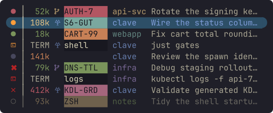

# clave 🥁

**Conduct a fleet of Claude Code agents from a Zellij sidebar.**

Run three agents and you can hold it in your head. Run eight and you can't.
You start tabbing through them to find the one that asked you a question ten
minutes ago. clave gives the fleet one vertical bar: every agent is a Zellij
tab running the real Claude TUI, and a glance tells you who needs an answer,
who is working, and who finished while you were looking elsewhere.

<!-- Regenerate this frame and every icon below with
     `cargo run -q -p clave-bar --example readme-assets`. The fleet is the
     showcase fixture in crates/clave-bar/examples/shared/showcase_fixture.rs.
     Edit it there, never here: the SVG is traced from the plugin's own
     renderer, so it can only change by changing the design. -->


## The whole vocabulary

Colour is the state; the shape only changes where a row isn't a live
conversation. Left to right, the cells of a row:

| status | battery | mark | chip | repo | text |
|---|---|---|---|---|---|
|  waiting on you | `105k` context spent, in tokens | *blank*, a plain checkout | your `/rename` | one colour per repo, wherever it appears | Claude's own description of the session, not your prompt |
|  working |  the same reading as a glyph, when the bar is collapsed |  on a branch | blank until you rename |  | on a terminal row, the last command it ran |
|  finished while you were away | `TERM`, a terminal tab |  in its own git worktree | on a terminal row, the tab's name | | |
|  idle | | | | | |
|  last turn failed | | | | | |
|  its directory is gone | | | | | |
|  dormant, half-faded. No process; opens where it left off | | | | | |
|  opening | | | | | |
|  a terminal tab. Same colour language | | | | | |

**The battery reads against your smart zone, not the model's window.** The
window is where Claude auto-compacts; the smart zone is how far you trust a
model to stay sharp, whatever it advertises. It defaults to 150,000 tokens.
Set your own in your shell config:

```bash
export CLAVE_AGENT_SMART_ZONE_TOKENS=150000
```

The colour moves through four bands and turns red at your zone, then stays
there. The count refreshes each turn, and a row that just `/clear`ed reads
full again, correctly: the battery measures the conversation the row is in,
never its history.

<sub>The bar renders these marks with your terminal's Nerd Font. The worktree
mark comes from Noto Sans Bamum, which macOS ships; on Linux, install it if
that one cell shows a box.</sub>

## Try it

You need [`zellij`](https://zellij.dev) (0.44.3 is what's tested), `claude`,
`git`, plus `fzf` and `zoxide` for the directory picker, and a
[Nerd Font](https://www.nerdfonts.com/) in your terminal. macOS and Linux.

```bash
curl --proto '=https' --tlsv1.2 -LsSf https://github.com/olliegilbey/clave/releases/latest/download/clave-installer.sh | sh

clave   # from a terminal OUTSIDE zellij; clave makes its own session
```

First launch sets the machine up: Zellij config and keybinds, clave's status
hooks in `~/.claude/settings.json` (additive, your own hooks are left alone),
and the plugin permission cache. That's what lets an agent report its own
state. `clave doctor` explains anything that didn't land.

Then `Alt+a`, pick a directory, choose `new`. That's your first agent.

**Upgrading?** Re-run the installer, quit every running clave session, start
fresh. Zellij swaps regenerated keybinds into sessions that are already
running, but a sidebar that is already loaded keeps the identity it booted
with, so a warm session would grow a second sidebar.

Tarballs, sha256s and build attestations are on the
[releases page](../../releases); verify with `gh attestation verify`.

<details>
<summary><b>Building from source</b></summary>

Rust (stable) and [`just`](https://just.systems), then:

```bash
git clone https://github.com/olliegilbey/clave && cd clave
git checkout v0.2.0        # `just release` refuses a dirty or untagged tree
just setup-toolchain       # adds the wasm32-wasip1 target, once
just release               # builds, then installs the launcher and versioned artifacts

# Put the launcher on your PATH in your SHELL CONFIG, not just this shell.
echo 'export PATH="$HOME/.local/share/clave/bin:$PATH"' >> ~/.zshrc    # zsh
echo 'export PATH="$HOME/.local/share/clave/bin:$PATH"' >> ~/.bashrc   # bash
exec $SHELL
```

</details>

## The keys

| | |
|---|---|
| `Alt+a` | add an agent: pick a directory, then new or resume |
| `Alt+↑` `Alt+↓` (or `Alt+k` `Alt+j`) | walk the running agents |
| `Alt+1`…`Alt+9` | jump straight to a row, running or closed |
| `Alt+Enter` | wake the selected closed row |
| `Alt+o` | back to where you were |
| `Alt+c` | collapse the bar to a strip, or expand it |
| `Alt+t` `Alt+w` | new tab, close tab |
| `Alt+f` | a scratch shell floating over the fleet; press again to tuck it away |

Everything clave binds lives on `Alt`. Five stock Zellij `Ctrl` bindings that
Claude Code needs (`Ctrl+g/t/o/b/q`) are unbound for you; the rest of
Zellij's keys still belong to Zellij.

## How it works

- **One agent is one Zellij tab** running the actual `claude` binary. Vim
  mode, slash commands, MCP servers, all of it. clave never reimplements the
  TUI; it just always knows where each conversation is.
- **Status comes from [Claude Code hooks](https://code.claude.com/docs/en/hooks)**,
  not screen-scraping. A row changes the moment the agent does.
- **Conversations survive restarts.** A cold start brings the fleet back as
  dormant rows; open one and it picks up where it left off.
- **Terminal tabs are rows too**, with their checkout, their last command,
  and whether it failed.
- **Running agents sit above closed ones**, so the fleet you're actually
  working stays a short cycle however many conversations you've accumulated.
- **Worktrees are first class.** An agent can have its own branch in its own
  directory, so two agents in one repo never fight over your working tree.

**What it isn't:** a wrapper around Claude, a scheduler, or something you
configure. There is no config file. The bar's layout is a ratified design,
not a preference, and clave's job is to get out of the way of the agents.

## Contributing

Want to work on it? Start with [CONTRIBUTING](CONTRIBUTING.md), especially
before you install anything over a running session. Something broke?
[Open an issue](../../issues); that's the most useful thing you can do.

## Why "clave"?

The **clave** is the foundational rhythm an entire ensemble locks to, the
part everything else syncs around. It's also Spanish for *key* / *keystone*
(it's keyboard-driven), and the archaic past tense of *cleave*, to split, as
in splitting the screen into panes. Logo: the two-stick percussion instrument.

## License

[MIT](LICENSE) © Oliver Gilbey
