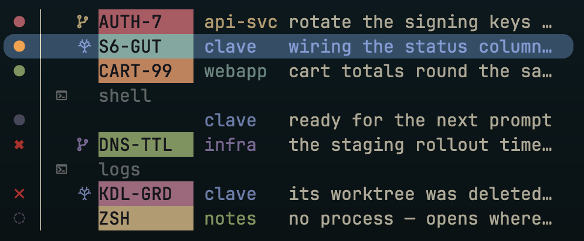

# clave 🥁

**Conduct a fleet of Claude Code agents from a Zellij sidebar.**

Run three agents and you can hold it in your head. Run eight and you can't — you
start tabbing through them to find the one that asked you a question ten minutes
ago. clave gives the fleet one vertical bar: every agent is a Zellij tab running
the real Claude TUI, and a glance tells you who needs an answer, who is working,
and who finished while you were looking elsewhere.

<!-- Regenerate: `cargo run -q -p clave-bar --example bar-preview -- --showcase`,
     screenshot the output, replace docs/assets/sidebar.png. The fleet is the
     `showcase()` fixture in that example — edit it there, not here, so the
     frame always comes from the real `render_rows`. -->


### The whole vocabulary

**Colour is the state.** The shape only changes where a row isn't a live
conversation.

| | | | |
|---|---|---|---|
| `●` red | waiting on you | `✖` | last turn failed |
| `●` amber | working | `✗` | its directory is gone |
| `●` green | finished while you were away | `◌` | dormant — no process, opens where it left off |
| `●` grey | idle | `↻` | opening |

Then, left to right across the row:

| | |
|---|---|
| *nothing* | a plain checkout — the common case, so it stays quiet |
| `󰘬` | on a branch |
| `𖣂` | in its own git worktree |
| `󰆍` | a terminal tab rather than an agent — the bar is the whole session |
| `105k` | the **battery** — how much context that session has spent, in tokens |
| **chip** | your `/rename`; blank until you rename |
| **repo** | one colour per repo, wherever it appears |
| **text** | Claude's own description of the session, not your prompt |

**The battery reads against your smart zone, not the model's window.** The
window is where Claude auto-compacts; the smart zone is how far *you* trust a
model to stay sharp, and it's the same number whether that model advertises 200k
or a million. It defaults to 150,000 tokens — set your own in your shell config:

```bash
export CLAVE_AGENT_SMART_ZONE_TOKENS=150000
```

The expanded bar prints the figure; collapse the bar and it becomes a glyph
(`󰁹`→`󰂎`) that empties a tenth at a time so you can watch it descend.
Either way the colour moves in four coarser bands, so a glance tells you enough
without reading the number. It turns red *at* your zone, and stays there — past
that point the glyph's reading is "out", not "how far out", which is the other
reason the expanded bar spells the count. A row that just `/clear`ed reads full
again, correctly: the battery measures the conversation the row is in, never its
history.

The count refreshes per turn (`Stop` / prompt-submit hooks), so a row mid-turn
shows the *previous* turn's figure — four digits expose that lag in a way the
glyph's coarser bands mostly hid.

<sub>These marks may show as boxes here on GitHub — they render in your
terminal. The branch and terminal marks are Nerd Font glyphs; the worktree mark
is U+168C2, which no Nerd Font carries — install Noto Sans Bamum (or any font
with Bamum coverage) as a fallback, or that one row shows a box. The screenshot
shows all of them.</sub>

## Try it

**Runtime:** `zellij` (0.44.3 is what's tested), `claude`, `git`, plus `fzf` and
`zoxide` for the directory picker. macOS and Linux. A
[Nerd Font](https://www.nerdfonts.com/) for the branch and terminal marks.

**To build:** Rust (stable) and [`just`](https://just.systems).

```bash
git clone https://github.com/olliegilbey/clave && cd clave
git checkout v0.1.3        # `just release` refuses a dirty or untagged tree
just setup-toolchain       # adds the wasm32-wasip1 target, once
just release               # builds, then installs the launcher and versioned artifacts

# Put the launcher on your PATH — in your SHELL CONFIG, not just this shell,
# or `clave` is gone the next time you open a terminal. Pick YOUR shell's file:
echo 'export PATH="$HOME/.local/share/clave/bin:$PATH"' >> ~/.zshrc    # zsh
echo 'export PATH="$HOME/.local/share/clave/bin:$PATH"' >> ~/.bashrc   # bash
exec $SHELL                # reload, so this shell sees it too

clave                      # from a terminal OUTSIDE zellij — clave makes its own session
```

No packaged release yet; building from a tag is the supported path. Take the tag
literally — earlier ones predate the launcher this puts on your PATH.

**Upgrading? Quit every running clave session first, and start it fresh
afterwards.** `just release` regenerates Zellij's keybinds, and Zellij swaps
those into sessions that are already running — but a sidebar that is already
loaded keeps the identity it booted with, so the next keypress opens a *second*
sidebar beside the first. A cold restart is the whole fix.

`just release` also registers clave's status hooks in `~/.claude/settings.json`
(additive — your own hooks are left alone) and seeds Zellij's plugin permission
cache. That's what lets an agent report its own state. `clave doctor` explains
anything that didn't land.

Then `Alt+a`, pick a directory, choose `new`. That's your first agent.

| | |
|---|---|
| `Alt+a` | add an agent — pick a directory, then new or resume |
| `Alt+↑` `Alt+↓` (or `Alt+k` `Alt+j`) | walk the running agents |
| `Alt+1`…`Alt+9` | jump straight to a row, running or closed |
| `Alt+Enter` | wake the selected closed row |
| `Alt+o` | back to where you were |
| `Alt+c` | collapse the bar to a strip, or expand it |
| `Alt+t` `Alt+w` | new tab, close tab |
| `Alt+f` | a scratch shell floating over the fleet — leaving it closes it |

`Alt` is clave's namespace. Five stock Zellij bindings that Claude Code needs
are unbound for you (`Ctrl+g/t/o/b/q`); the rest of Zellij's `Ctrl` keys still
belong to Zellij ([#24](../../issues/24)). `Alt+f` is the one stock key clave
takes over rather than unbinds: Zellij's own `Alt+f` toggles floating panes and
so opens the first one at a size nothing chose, tiny enough to need resizing
every time. Clave's replacement opens your shell at a fixed, workable size
([#188](../../issues/188)) — four-fifths of the room to the right of the bar,
starting flush against the bar's edge. Zellij's toggle is still there under
every mode other than the default one. One cost: `Alt+f` used to reach the
program you were typing in, where it is readline's "forward one word", and clave
now takes it — `Alt+b` still moves back a word, so word motion in a prompt is
one-directional.

## How it works

- **One agent = one Zellij tab**, running the actual `claude` binary — vim mode,
  slash commands, MCP servers, all of it. clave never reimplements the TUI. It
  just always knows where each conversation is.
- **Status comes from [Claude Code hooks](https://code.claude.com/docs/en/hooks)**,
  not screen-scraping. Each agent reports its own turn lifecycle, so a row
  changes the moment the agent does.
- **Conversations survive restarts.** Every pane runs an idempotent
  resume-or-create. A cold start reopens your most recent agent and brings the
  rest back as dormant rows — open one and it picks up where it left off,
  including the ones you've `/clear`ed, which start a fresh session id
  underneath.
- **Running agents sit above closed ones**, in their own list, and `Alt+j`/
  `Alt+k` walk one list at a time — so the fleet you're actually working stays a
  short cycle however many conversations you've accumulated. Click into the
  closed list (or jump there with a number key) and the arrows walk that list
  instead; click back to a running agent and they walk the top list again.
  Waking a closed conversation always takes `Alt+Enter`.
- **Worktrees are first class.** `clave add --worktree` puts an agent on its own
  branch in its own directory, so two agents in one repo never fight over your
  working tree.

**What it isn't:** a wrapper around Claude, a scheduler, or something you
configure. There is no config file — the bar's layout is a ratified design, not
a preference, and clave's job is to get out of the way of the agents.

## Status

🚧 Early, and its author's daily driver — clave is developed from inside a clave
session, which is why the rough edges get found fast. If something breaks,
[open an issue](../../issues); that's the most useful thing you can do right now.

Design and rationale:
[the orchestrator design spec](docs/superpowers/specs/2026-06-30-clave-orchestrator-design.md).
Want to work on it? [CONTRIBUTING](CONTRIBUTING.md) — start there rather than
here, especially before you install anything over a running session.

## Why "clave"?

The **clave** is the foundational rhythm an entire ensemble locks to — the part
everything else syncs around. It's also Spanish for *key* / *keystone* (it's
keyboard-driven), and the archaic past tense of *cleave*, to split — as in
splitting the screen into panes. Logo: the two-stick percussion instrument.

## License

[MIT](LICENSE) © Oliver Gilbey
