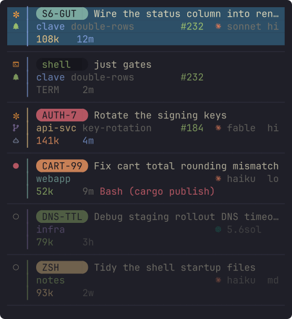
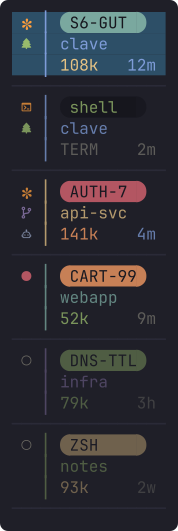

# clave 🥁

## Terminal sidebar for agent orchestration

**Coordinate your many agents with ease from a terminal sidebar - giving you glanceable information and quick navigation - where you are right at home already.**

Stop dealing with everyone creating yet another Electron app to manage agents and just do it from your favourite place. We've come to love vertical tabs in a browser, and chatbot interfaces, now it's in your terminal - where you can see what state each agent is in and visually distinguish between them. And you can still have terminals interleaved between your agents.

<!-- Regenerate these frames and every icon below with
     `cargo run -q -p clave-bar --example readme-assets`. The fleet is the
     showcase fixture in crates/clave-bar/examples/shared/showcase_fixture.rs.
     Edit it there, never here: the SVG is traced from the plugin's own
     renderer, so it can only change by changing the design. -->

Every agent is a two-line card, and the sidebar has an expanded and a collapsed view:

| expanded                                                                                                                                                                                                                                                                                     | collapsed                                                                                                                                                                             |
| ---------------------------------------------------------------------------------------------------------------------------------------------------------------------------------------------------------------------------------------------------------------------------------------------- | --------------------------------------------------------------------------------------------------------------------------------------------------------------------------------------- |
|  |  |

Prefer one line per agent? `clave rows single` gives you the classic dense list, where the token count becomes a battery glyph () when the bar is collapsed. It takes effect at your next launch.

## What the colours and glyphs mean

<table>
<tr><td><b>status</b></td><td> waiting on you ·  working ·  finished while you were away ·  idle ·  last turn failed ·  its directory is gone ·  dormant, half-faded; opens where it left off ·  opening ·  a terminal tab (colours mean the same)</td></tr>
<tr><td><b>battery</b></td><td><code>105k</code> context spent, in tokens, coloured by how much of your smart zone is gone<br><code>TERM</code>, a terminal tab<br><i>blank</i>, nothing measured yet</td></tr>
<tr><td><b>mark</b></td><td><i>blank</i>, the repo's ordinary checkout ·  on a branch ·  in its own git worktree</td></tr>
<tr><td><b>chip</b></td><td>the name you gave the session with <code>/rename</code>; blank until you do<br>on a terminal row, the tab's name</td></tr>
<tr><td><b>repo</b></td><td> one colour per repo, wherever it appears</td></tr>
<tr><td><b>text</b></td><td>Claude's own description of the session, not your prompt<br>on a terminal row, the last command it ran</td></tr>
<tr><td><b>branch</b></td><td>the branch this checkout is on, beside the repo; expanded view only<br><i>blank</i>, an ordinary checkout</td></tr>
<tr><td><b>PR</b></td><td><code>#232</code>, the pull request this branch is driving, looked up in the background<br><i>blank</i>, there isn't one</td></tr>
<tr><td><b>agent</b></td><td>  who is running the conversation, in their own colour, and the model beside it (<code>fable</code>, <code>sonnet</code>). Codex isn't supported yet: the icon is ready, the launch profile is on its way</td></tr>
<tr><td><b>effort</b></td><td>how hard the agent is thinking, as set with <code>/effort</code>: <code>lo</code> <code>md</code> <code>hi</code> <code>xh</code> <code>mx</code> <code>au</code><br><i>blank</i>, nothing read yet</td></tr>
<tr><td><b>elapsed</b></td><td>how long since you last spoke to this agent (<code>4m</code>, <code>3h</code>, <code>2w</code>)</td></tr>
</table>

Seeing used context per agent is powerful, so the token count sits on every card in both views, coloured by how close that conversation is to the end of its useful thinking.
You can set where you believe the smart zone of your model ends, which is where the count turns red:

```bash
export CLAVE_AGENT_SMART_ZONE_TOKENS=150000   # the default
```

Pairs well with [rot-reducer](https://github.com/olliegilbey/rot-reducer), a plugin that informs Claude itself when its context is running low.

## Try it

You need [`zellij`](https://zellij.dev) (0.44.3 is what's tested), `claude`,
`git`, plus `fzf` and `zoxide` for the directory picker (your fleet ranks it, zoxide fills in the rest), and a
[Nerd Font](https://www.nerdfonts.com/) in your terminal, version 3.5 or newer
so the provider icons have glyphs. macOS and Linux.

```bash
curl --proto '=https' --tlsv1.2 -LsSf https://github.com/olliegilbey/clave/releases/latest/download/clave-installer.sh | sh

clave   # from a terminal OUTSIDE zellij; clave makes its own session
```

First launch sets the machine up: Zellij config and keybinds, clave's status
hooks in `~/.claude/settings.json` (additive, your own hooks are left alone),
a wrap around your Claude status line command so the battery reads live (your
command still runs, unchanged; with none of your own, the wrap prints nothing),
and the plugin permission cache. That's what lets an agent report its own
state. `clave doctor` explains anything that didn't land.

Then `Alt+a`, pick a directory, choose `new`. That's your first agent.

**Upgrading?** Re-run the installer, quit every running clave session, start
fresh.

<details>
<summary><b>Building from source</b></summary>

Rust (stable) and [`just`](https://just.systems), then:

```bash
git clone https://github.com/olliegilbey/clave && cd clave
git checkout v0.4.0        # `just release` refuses a dirty or untagged tree
just setup-toolchain       # adds the wasm32-wasip1 target, once
just release               # builds, then installs the launcher and versioned artifacts

# Put the launcher on your PATH in your SHELL CONFIG, not just this shell.
echo 'export PATH="$HOME/.local/share/clave/bin:$PATH"' >> ~/.zshrc    # zsh
echo 'export PATH="$HOME/.local/share/clave/bin:$PATH"' >> ~/.bashrc   # bash
exec $SHELL
```

</details>

## The keys

|                                      |                                                                                                     |
| ------------------------------------ | --------------------------------------------------------------------------------------------------- |
| `Alt+a`                              | add an agent: pick a directory, then `new` or `resume`                                              |
| `Alt+↑` `Alt+↓` (or `Alt+k` `Alt+j`) | walk the running agents                                                                             |
| `Alt+1`…`Alt+9`                      | jump straight to a row, running or closed                                                           |
| `Alt+Enter`                          | wake the selected closed row                                                                        |
| `Alt+o`                              | back to where you were                                                                              |
| `Alt+c`                              | toggle collapsed or expanded view of the sidebar                                                    |
| `Alt+t` `Alt+w`                      | new terminal tab, close tab                                                                         |
| `Alt+f`                              | toggle a floating shell over the current tab, great for your terminal based editor at the same time |

Everything clave binds lives on `Alt`. Five stock Zellij `Ctrl` bindings that
Claude Code needs (`Ctrl+g/t/o/b/q`) are unbound for you; the rest of
Zellij's keys still belong to Zellij.

## How it works

- Each tab is a terminal. As usual. But with extra info shown in the tab text.
- If the terminal is an agent TUI (like Claude Code), the sidebar is populated with rich information about the agent state.
- Sidebar state comes from either [Claude Code hooks](https://code.claude.com/docs/en/hooks), or from your `.claude` `jsonl` store that Claude Code already keeps.
- **Conversations survive restarts.** A cold start brings the fleet back as dormant rows; open one (with `Alt+Enter`) and it picks up where it left off.
- **Running tabs sit above closed ones**, so the agents and terminals you're using are quick to cycle through (with `Alt+↑` `Alt+↓`).
- **The tab list orders itself by attention.** A modified "frecency" algorithm is used to keep the tabs you're most likely to reuse at the top.

## Contributing

Want to work on it? Start with [CONTRIBUTING](CONTRIBUTING.md). Something broke? [Open an issue](../../issues).

## Why "clave"?

The **clave** is the foundational rhythm an entire ensemble locks to, the
part everything else syncs around. It's also Spanish for _key_ / _keystone_
(it's keyboard-driven), and the archaic past tense of _cleave_, to split, as
in splitting the screen into panes.

## License

[MIT](LICENSE) © Oliver Gilbey
